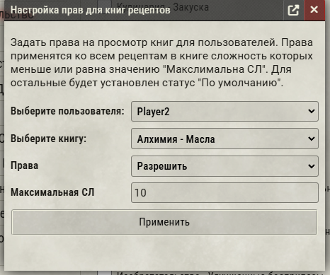

## Набор рецептов для модуля MasterCrafter

Данный набор рецептов предназначен для использования в системе Foundry VTT совместно с модулем MasterCrafted

## Для работы необходимы модули
* [MasterCrafted](https://foundryvtt.com/packages/mastercrafted) (Платный) 
* [Kraywell Crafting Сompendium](https://github.com/Kraywell/Kraywell-Crafting-compendium) (Бесплатный)

# Инструкция по использованию
## Импорт рецептов
1. Перейдите во вкладку Предметы и откройте инструмент импорта.

 
 
2. В появившемся списке выберите нужные книги рецептов и нажмите «Импортировать выбранные».

3. Импортированная книга появится в интерфейсе модуля **MasterCrafted**.

## Настройка прав доступа к рецептам

1. В интерфейсе управления книгами нажмите на кнопку **"Настройки прав"**.
2. В появившемся окне выберите:
    * Игрока, которому хотите назначить права.
    * Книгу рецептов.
    * Тип прав доступа.
   * Максимальную сложность рецептов, на которые будут назначены права.

  После сохранения настройки, указанные права будут автоматически применены ко всем рецептам, сложность которых ниже или равна выбранной максимальной сложности. Это удобно при необходимости выставить права сразу на большое количество рецептов.

# Важно
Из-за особенностей реализации модуля MasterCrafted, загрузка большого количества книг рецептов или книг с очень большим числом рецептов может значительно замедлить интерфейс. Чтобы избежать этой проблемы:

* Загружайте только необходимые книги рецептов.

* По умолчанию права доступа к рецептам установлены в состояние «Запретить», поэтому игроки не видят рецепты без предварительной настройки прав.