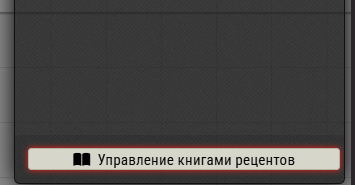
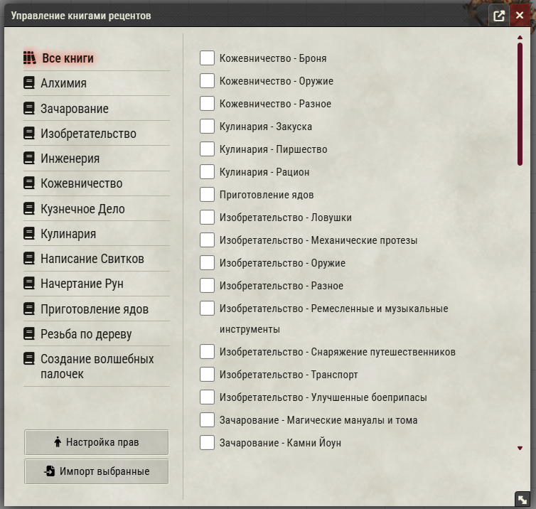
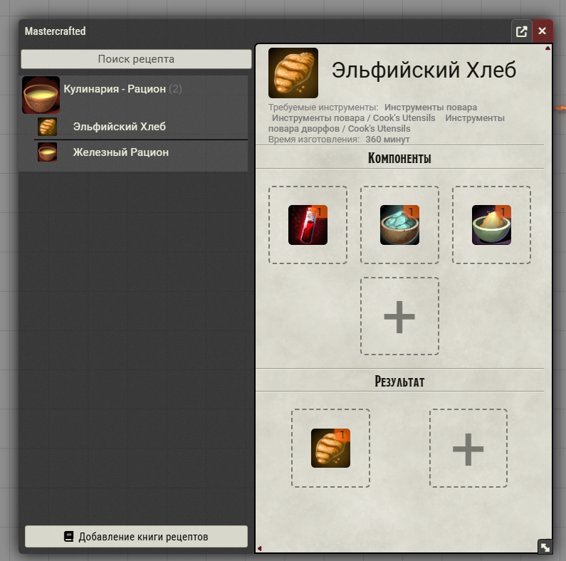

## Набор рецептов для модуля MasterCrafter
## Для работы необходимы модули
* [MasterCrafted](https://foundryvtt.com/packages/mastercrafted) (Платный) 
* [Kraywell Crafting Сompendium](https://github.com/Kraywell/Kraywell-Crafting-compendium) (Бесплатный)

## Как пользоваться
1. Откройте модуль импорта на вкладке предметов

 
 
2. Выберите нужные книги из списка и нажмите "Импорт выбранные"

3. Книга должна загрузиться в интерфейс MasterCrafted

# Важно
Из-за того, как написан MasterCrafted, если у вас много книг рецептов, или в них много рецептов, то интерфейс MC будет нещадно тормозить при первом открытии и если вы будете пытаться что-то изменить. Не загружайте большое количество книг, лучше только те, что нужны игркоам.
По умолчанию права на рецепты выставлены "Запретить", то есть они не должны видеть рецепты.